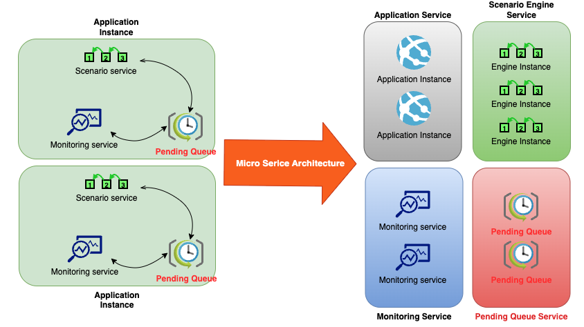
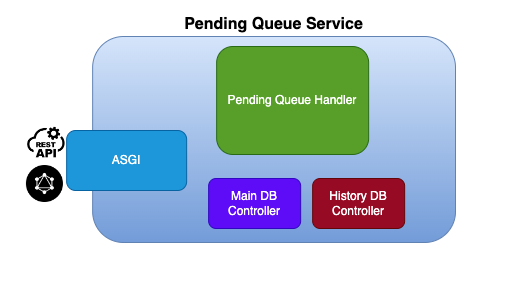
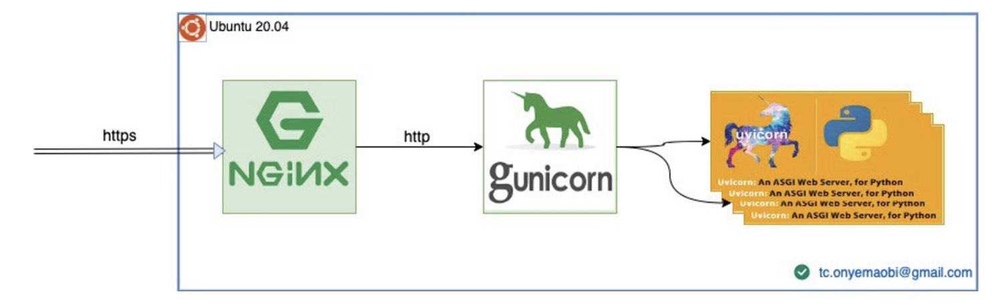

# Pending Queue Service

## MSA 기반의 지연 큐 서비스



- 기존의 어플리케이션 구조에서 스케줄링 잡을 처리하는 지연 큐 서비스가 클라우드 기반의 수평 스케일링 구조에서 기능 수행이 불가능.
- 별도의 지연 큐 서비스가 필요. 이러한 스케줄 작업을 수행하는 서비스는 다수 존재하지만 지연 큐 역할만을 수행하는 분리된 서비스가 없음.
- 클라우드 환경에서 사용 가능한 수평적인 확장이 가능한 서비스 개발이 필요.


## 서비스 개요

- 지연 큐 서비스는 Restful 기반의 수평 확장이 가능한 지연 큐 서비스.
- MSA 기반의 어플리케이션 환경에서 기존 어플리케이션이 수행하는 스케줄링 모듈에 대해서, 별도의 스케줄링 서비스를 분리해서 제공하는 서비스를 제공합니다.

## 서비스 특징

- 파이썬 ASGI를 기반으로 제공되는 FastAPI 사용
- 서비스 부하에 따른 수평적 확장을 스케줄 관리에 사용 가능.
- 서비스 재시작에도 별도의 스케줄 관리 DB를 통한 스케줄 복구 기능
- Rest API 외에 GraphQL 인터페이스 제공.


## 사용 가능한 용도

  - 크론(cron) 기반의 스케줄잡(Schedule Job) 핸들러
  - 특정한 날짜 혹은 특정한 주기로 실행되는 태스크 실행 엔진
  - 특정한 이벤트를 등록 관리하고, 이벤트를 기반으로 특정 기능을 실행하거나 데이터를 전달하는 브로커


## 지연 큐 구성



### ASGI(FastAPI)

#### ASGI와 FastAPI
- 파이썬은 Django와 Flask가 대표적인 웹 프레임워크로서, PEP3333(https://peps.python.org/pep-3333/) WSGI를 기반으로 제공.
- WSGI의 성능 이슈의 원인 중 하나인 동기식 처리의 한계를 극복하고 비동기 코드 수행이 가능한 ASGI가 제안되었으며, 본 서비스에서 제공하는 FastAPI 또한 ASGI를 기반으로 구현되어 기존 WSGI 프레임워크에 비해 월등한 성능을 제공
  (https://www.techempower.com/benchmarks/#section=data-r21&hw=ph&test=query&l=zijmkf-1r&f=zhb2t3-zik0zj-zik0zj-zijzen-zijunz-zik0zj-zik0zj-ziimf3-zik0zj-zih7un-73)
- FastAPI는 대표적인 파이썬 GraphQL 라이브러리 중에 하나인 Strawberry를 통해서 GraphQL 인터페이스 제공도 가능. (https://fastapi.tiangolo.com/advanced/graphql/)
- FastAPI는 ASGI 서버 중 하나인 Uvicorn을 통해서 수행. Uvicorn은 Node에서 사용되는 libuv를 Cython 기반으로 작성한 uvloop 모듈을 베이스로 구현.
- 참고로,Uvicorn은 프로세스 단위로 실행되는 단점을 가지고 있으나, 이러한 단점을 극복하기 위해서 gunicorn을 사용 가능하며 다음과 같은 구성 가능




### Schedule Handler

- Python에서 제공하는 비동기 모듈(asyncio, coroutine)을 기반으로 효율적으로 스케줄을 처리하도록 설계.
  

- 어플리케이션 비정상 종료 등으로 재시작 시, 등록된 스케줄을 다시 등록.


## API Document

로컬 설치의 경우 다음 URL을 통해서 제공되는 API들을 확인하실 수 있습니다.

**http://127.0.0.1:9903/docs**


## 설치 및 실행

### 파이썬 버전

- python 3.9 or later


### 필수 모듈 설치

```bash
pip install -r src/requirements.txt
```

### 설치 시 오류 대처
##### 맥에서 psycopg2 설치 시 에러가 날 경우.

```bash
# please 
brew install postgresql
```


### ***config.yaml*** 준비

***config/config.yaml***을  ***src/*** 디렉토리에 복사하고 필요 시 일부 모듈을 수정합니다.


### API 서버 실행

```bash
cd src
python3 main.py
```

### 유닛 테스트 코드 실행

```bash
cd src
python3 -m unittest discover -s test -p "*_test.py"
```


## Additional Things

### 도커 이미지 생성 및 배포

```bash
# build a docker image
./build.sh

# push the docker image
./push.sh
```


### 쿠버네티스 배포

k8s/* 파일들을 참조하여 배포합니다.

```bash
kubectl apply -f k8s/statefulset-readwriteonce.yaml
kubectl apply -f k8s/service.yaml

```

### 코드 포맷터

Black(https://github.com/psf/black)

```bash
pip install black
```
