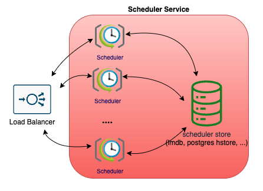
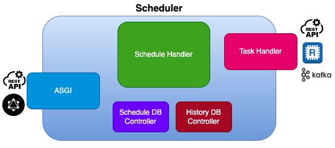

# 스케줄러 서비스

- Scheduler에 등록되는 모든 이벤트들은 cron을 포함한 여러 형태의 스케줄 타입 및 값이 지정
- 사용자가 지정한 스케줄 형태에 따라서 이벤트가 호출되며, 일반적으로 호출된 이벤트는 사용자가 등록 시에 지정한 rest api를 호출 
- 호출된 이벤트가 실패할 경우 정책에 따라서 일정 시간 이후 재시도 수행
- 스케줄러 처리의 부하를 분산하기 위해서 새롭게 설계된 구조로서 스케줄러는 데이터베이스 기반의 큐 구조를 사용하여 모든 스케줄 데이터를 관리
- 스케줄러는 다음과 같이 미리 정의된 주기를 기반으로 스케줄큐의 데이터를 처리하도록 구현.(실제 확인 결과 스케줄 처리를 수행하지 않을 경우 6m CPU를 사용.)
  ```bash
  NAME                         CPU(cores)   MEMORY(bytes)
  scheduler-75c5b45dc4-cvfmq   9m           106Mi
  scheduler-75c5b45dc4-qbgx6   10m          110Mi
  scheduler-75c5b45dc4-ttxhq   8m           108Mi
  ```
### 스케줄러의 주기적 처리에 대한 Diagram
  


- 구조가 간결하고 추가적인 다른 서비스 없이 운용 가능하다는 점이 장점
- 각 인스턴스가 휴지 기간 없이 주기적으로 깨어나서 데이터베이스 내에 스케줄 큐를 확인해야 한다는 점이 단점.

### (대안) 스케줄러의 깨어나는 시점을 또다른 모니터링 인스턴스가 주기적으로 확인해서 모든 스케줄러에게 Publish하는 구조
  


- 모든 인스턴스는 모니터링 인스턴스를 통해서 받는 다음 스케줄의 타임스탬프 정보에 의해서 스케줄 처리를 수행.
- 추가적인 서비스(redis) 필요하며, 개별 인스턴스는 지속적으로 다음 스케줄에 대한 정보를 가지고 있어야 함.

  

## MSA 기반의 스케줄러 서비스


- 기존의 어플리케이션 구조에서 스케줄링 잡을 처리하는 스케줄러 서비스가 클라우드 기반의 수평 스케일링 구조에서 기능 수행이 불가능.
- 별도의 스케줄러 서비스가 필요. 이러한 스케줄 작업을 수행하는 서비스는 다수 존재하지만 스케줄러 역할만을 수행하는 분리된 서비스가 없음.
- 클라우드 환경에서 사용 가능한 수평적인 확장이 가능한 서비스 개발이 필요.


## 서비스 개요



- 스케줄러 서비스는 Restful 기반의 수평 확장이 가능한 스케줄러 서비스.
- MSA 기반의 어플리케이션 환경에서 기존 어플리케이션이 수행하는 스케줄링 모듈에 대해서, 별도의 스케줄링 서비스를 분리해서 제공하는 서비스를 제공합니다.

## 서비스 특징

- 파이썬 ASGI를 기반으로 제공되는 FastAPI 사용
- 서비스 부하에 따른 수평적 확장을 스케줄 관리에 사용 가능.
- 서비스 재시작에도 별도의 스케줄 관리 DB를 통한 스케줄 복구 기능
- Rest API 외에 GraphQL 인터페이스 제공.


## 사용 가능한 용도

  - 크론(cron) 기반의 스케줄잡(Schedule Job) 핸들러
  - 특정한 날짜 혹은 특정한 주기로 실행되는 태스크 실행 엔진
  - 특정한 이벤트를 등록 관리하고, 이벤트를 기반으로 특정 기능을 실행하거나 데이터를 전달하는 브로커


## 스케줄러 구성



### ASGI(FastAPI)

#### ASGI와 FastAPI
- 파이썬은 Django와 Flask가 대표적인 웹 프레임워크로서, PEP3333(https://peps.python.org/pep-3333/) WSGI를 기반으로 제공.
- WSGI의 성능 이슈의 원인 중 하나인 동기식 처리의 한계를 극복하고 비동기 코드 수행이 가능한 ASGI가 제안되었으며, 본 서비스에서 제공하는 FastAPI 또한 ASGI를 기반으로 구현되어 기존 WSGI 프레임워크에 비해 월등한 성능을 제공
  (https://www.techempower.com/benchmarks/#section=data-r21&hw=ph&test=query&l=zijmkf-1r&f=zhb2t3-zik0zj-zik0zj-zijzen-zijunz-zik0zj-zik0zj-ziimf3-zik0zj-zih7un-73)
- FastAPI는 대표적인 파이썬 GraphQL 라이브러리 중에 하나인 Strawberry를 통해서 GraphQL 인터페이스 제공도 가능. (https://fastapi.tiangolo.com/advanced/graphql/)
- FastAPI는 ASGI 서버 중 하나인 Uvicorn을 통해서 수행. Uvicorn은 Node에서 사용되는 libuv를 Cython 기반으로 작성한 uvloop 모듈을 베이스로 구현.
- 참고로,Uvicorn은 프로세스 단위로 실행되는 단점을 가지고 있으나, 이러한 단점을 극복하기 위해서 gunicorn을 사용 가능하며 다음과 같은 구성 가능


### Schedule Handler

- Python에서 제공하는 비동기 모듈(asyncio, coroutine)을 기반으로 효율적으로 스케줄을 처리하도록 설계.
  

- 어플리케이션 비정상 종료 등으로 재시작 시, 등록된 스케줄을 다시 등록.


#### Format
스케줄을 등록하기 위한 포맷의 예는 다음과 같습니다.

```json
{
  "name": "bbb",
  "client": {
    "operation": "op#1",
    "application": "chef",
    "group": "system",
    "key": "12345678",
    "type": "scheduler"
  },
  "type": "cron",
  "schedule": "30 * * * * *",
  "timezone": "Asia/Seoul",
  "task": {
    "type": "rest",
    "connection": {"host": "http://localhost:3000/api/unstable/run-scenario/DELAY-TEST-9", "headers": {"Content-Type": "application/json", "accept": "*/*", "Authorization": "Bearer ..."}},
    "data": {"instanceName": "delay-test-999", "variables": {}},
    "history_check": false,
    "failed_policy": "retry",
    "retry_wait": 60
  }
}

```

- name: 스케줄의 이름
- client: 클라이언트 정보를 표현합니다. 실제 스케줄은 5개의 요소가 모두 일치할 때 동일한 스케줄로 인식
  - operation: 공정과 같은 별도의 스케줄 용도를 표현
  - application: 클라이언트 어플리케이션 이름
  - group: 도메인 정보
  - key: 스케줄 구분을 위한 별도의 키
  - 타입: 해당 스케줄 자체에 대한 리소스 타입
- type: 스케줄 타입으로서 크게, cron, now, date, delay, delay-recur으로 구성됩니다. 자세한 설명은 다음 항목을 참조
- schedule: 스케줄 타입에 따라 별도의 문자열이 지정됩니다. 자세한 설명은 아래 'Scheduler Type'을 참조.
- timezone: 스케줄 처리를 위한 타임존 문자열(예. Asiz/Seoul)을 지정.
- task: 해당 스케줄이 처리되어야할 때 필요한 태스크 정보를 포함.
  - type: 태스크의 타입으로서, 크게 rest, kafka, redis 중 하나를 지정. rest의 경우 post만 지원합니다.
  - connection: 해당 태스크가 수행되기 위한 연결 정보 
    - host: 서버 연결 정보
    - topic: kafka와 redis 타입일 때 지정.
    - headers: rest 타입일 경우 선택적으로 지정.
  - data: 해당 태스크 수행 시 전달되어야 하는데이터를 지정
  - history_check: 스케줄의 등록, 실행, 삭제, 재실행에 대한 히스토리를 별도의 DB에 저장. 

### Schedule Type

- delay: 특정한 시간(초) 동안 대기 후에 스케줄을 실행합니다.
  ```json
  {
    ...
    "type": "delay",
    "schedule": "50",
    "timezone": "Asia/Seoul",
    ...
  }
  ```

- delay-recur: 특정 시간(초) 동안 대기 후에 실행되는 스케줄을 반복 합니다.
  ```json
  {
    ...
    "type": "delay-recur",
    "schedule": "50",
    "timezone": "Asia/Seoul",
    ...
  }
  ```    

- cron: cron format을 기반으로 스케줄이 동작합니다. 
  - 기본적인 5개 포맷을 사용합니다.
  - 초 단위 스케줄리을 실행하기 위해서는 6개 시간 요소가 필요하면, 첫번째 요소가 초를 지정합니다.
  ```json
  {
    ...
    "type": "cron",
    "schedule": "0 * * * *",
    "timezone": "Asia/Seoul",
    ...
  }
  ```    

- date: 특정한 일자 및 시간을 지정.(ISO 포맷, YYYY-MM-DDThh:mm:ss)
  ```json
  {
    ...
    "type": "date",
    "schedule": "2023-04-05T12:30:00",
    "timezone": "Asia/Seoul",
    ...
  }
  ```
  

- now: 바로 지금 해당 스케줄을 실행
  ```json
  {
    ...
    "type": "now",
    "schedule": "",
    "timezone": "Asia/Seoul",
    ...
  }
  ```


### Task Type

- Rest

  ```json
  {
    ...
    "task": {
      "type": "rest",
      "connection": {"host": "http://localhost:3000/api/unstable/run-scenario/test-scenario-1", "headers": {"Content-Type": "application/json", "accept": "*/*"}},
      "data": {"instanceName": "test-scenario-1", "variables": {}}
    }
  }
  ```

- Kafka & Redis

  ```json
  {
    ...
    "task": {
      "type": "kafka",
      "connection": {"host": "localhost:9092", "topic": "example-topic"},
      "data": { ... }
    }
  }
  ```

## API Document

로컬 설치의 경우 다음 URL을 통해서 제공되는 API들을 확인하실 수 있습니다.

**http://127.0.0.1:9902/docs**


## 설치 및 실행

### 파이썬 버전

- python 3.9 or later


### 필수 모듈 설치

```bash
pip install -r src/requirements.txt
```

### 설치 시 오류 대처
##### 맥에서 psycopg2 설치 시 에러가 날 경우.

```bash
# please 
brew install postgresql
```


### ***config.yaml*** 준비

***config/config.yaml***을  ***src/*** 디렉토리에 복사하고 필요 시 일부 모듈을 수정합니다.


### API 서버 실행

```bash
cd src
python3 main.py
```

### 유닛 테스트 코드 실행

```bash
cd src
python3 -m unittest discover -s test -p "*_test.py"
```


## Additional Things

### 도커 이미지 생성 및 배포

```bash
# build a docker image
./build.sh

# push the docker image
./push.sh
```


### 쿠버네티스 배포

k8s/* 파일들을 참조 합니다.
모든 엔티티들은 hfsvc에 배포합니다.
* hfsvc: hatiolab foundation service

```bash
kubectl create cm scheduler-cm --from-file ./config -n hfsvc
kubectl apply -f k8s/deployment.yaml
kubectl apply -f k8s/service.yaml

```

### 코드 포맷터

Black(https://github.com/psf/black)

```bash
pip install black
```
